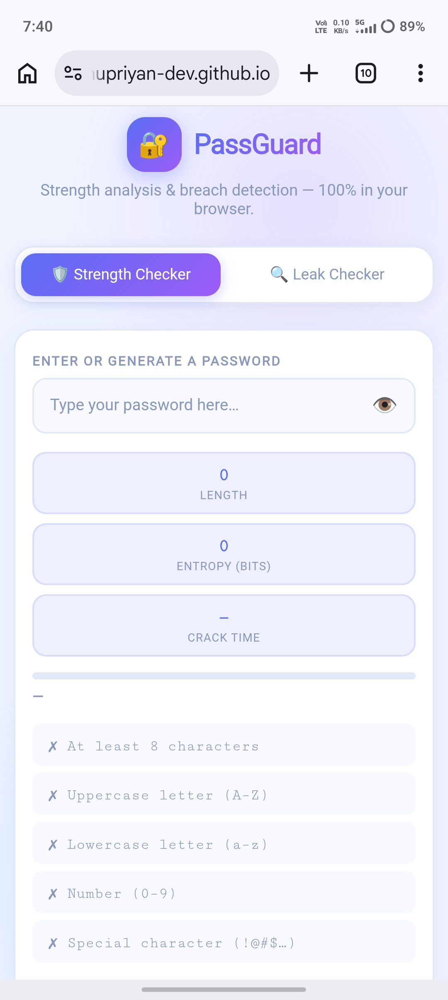

🛡️ PassGuard

PassGuard is a modern, privacy-focused password security toolkit built using HTML, CSS, and JavaScript. It helps users create strong passwords, evaluate password strength, and check whether a password has appeared in known data breaches—all through a clean and responsive interface.

✨ Features

- 🔐 Secure Password Generator
- 💪 Password Strength Checker
- 🛡️ Password Leak Checker
- 👁️ Show / Hide Password
- 📱 Fully Responsive Design
- 🎨 Modern and User-Friendly UI
- ⚡ Fast Client-Side Processing
- 🔒 Privacy-First Approach

🛡️ Password Leak Checker

PassGuard uses the Have I Been Pwned Passwords API with the k-Anonymity model.

- Your plain-text password is never sent over the internet.
- The password is converted into a SHA-1 hash in your browser.
- Only the first 5 characters of the hash are sent to the API.
- The remaining comparison happens locally, helping protect your privacy.

🛠️ Built With

- HTML5
- CSS3
- JavaScript (ES6)
- Have I Been Pwned Passwords API

🚀 Live Demo

https://muthupriyan-dev.github.io/passguard_ultimate/

## 📸 Screenshots

### Home

### Password Generator

### Password Strength Checker

### Password Leak Checker

🤝 Contributing

Contributions, suggestions, and feedback are always welcome.

1. Fork the repository.
2. Create a new branch.
3. Commit your changes.
4. Open a Pull Request.

📄 License

This project is licensed under the MIT License.

👨‍💻 Developer

Muthupriyan

GitHub: https://github.com/muthupriyan-dev

If you found this project useful, consider giving it a ⭐ on GitHub!
